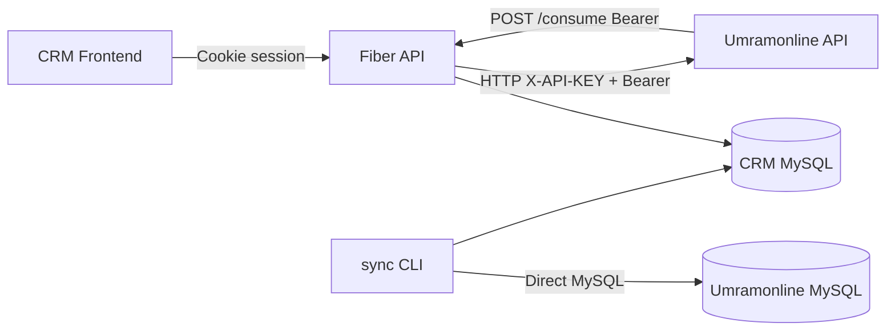
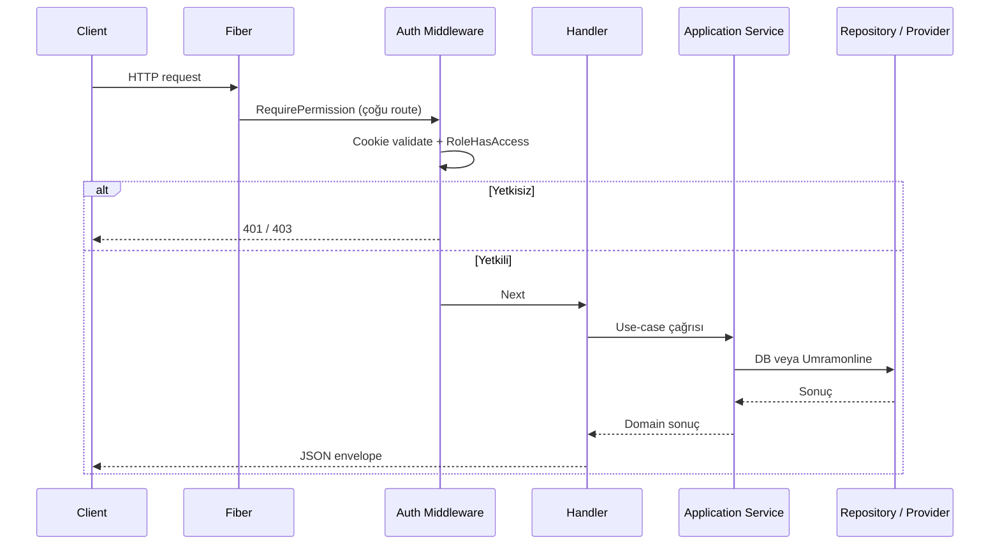

# Mimari

## Katmanlı yapı

Her iş alanı (bounded context) aynı katman düzenini izler:

```
internal/<modül>/
  domain/              # Entity, DTO, event tipleri, basit validasyon
  application/         # Use-case servisleri + Repository/Provider interface’leri
  infrastructure/
    http/              # Fiber handlers, middleware
    persistence/       # GORM modelleri + repository
    umramonline/       # Dış API adapter (varsa)
    storage/           # Dosya depolama (follow-up)
```

### Katman sorumlulukları

| Katman | Sorumluluk |
|--------|------------|
| `domain` | İş kavramları, sabitler, basit kurallar (telefon formatı, OTP uzunluğu vb.) |
| `application` | Use-case orkestrasyonu, validasyon, interface tanımları |
| `infrastructure` | HTTP, DB, dosya sistemi, Umramonline client adapter’ları |

Bağımlılık yönü: `infrastructure` → `application` → `domain`. Interface’ler application katmanında tanımlanır (Dependency Inversion).

## Modüller (bounded context’ler)

| Modül | Path | Veri kaynağı |
|-------|------|--------------|
| `auth` | `internal/auth` | Umramonline (OTP/login) + local token üretimi |
| `authorization` | `internal/authorization` | Local DB (permissions) + Umramonline (roles) |
| `customer` | `internal/customer` | Hibrit: MySQL + Umramonline |
| `task` | `internal/task` | MySQL + Umramonline (branch/user/SMS) |
| `followup` | `internal/followup` | MySQL + local disk |
| `ietts` | `internal/ietts` | MySQL |
| `dashboard` | `internal/dashboard` | Hibrit: MySQL aggregations + Umramonline stats |
| `consume` | `internal/consume` | MySQL (event ledger + customer upsert) |

Paylaşılan altyapı:

- `internal/umramonline` — HTTP client
- `internal/shared` — response envelope, admin role helper
- `internal/infrastructure` — config, Fiber server, DB open

## Uygulanan prensipler

Clean Architecture ve SOLID — detay: repo kökü `.cursor/rules/clean-architecture.mdc`

- **Modüler / feature-sliced** ayrım
- **Repository pattern** — DB erişimi interface arkasında
- **Provider / Anti-Corruption Layer** — Umramonline dış API
- **Dependency Inversion** — interface application’da, implementasyon infrastructure’da
- **Manual DI** — `cmd/api/main.go` composition root (DI framework yok)
- **RBAC** — rol → module_method (HTTP method + Fiber route path)
- **Graceful shutdown** — SIGINT/SIGTERM + timeout

## Composition root

`cmd/api/main.go` tüm bağımlılıkları elle bağlar:

1. Config yükle
2. Umramonline client oluştur
3. MySQL aç
4. AutoMigrate + permission seed
5. Repository / Provider / Service / Handler oluştur
6. Fiber server’a handler’ları ver
7. Listen + graceful shutdown

## Yüksek seviye akış



## İstek yaşam döngüsü



## Dizin yapısı

```
cmd/
  api/                              # Ana HTTP sunucu
  sync-umramonline-customers/       # Toplu müşteri backfill
internal/
  auth/
  authorization/
  customer/
  task/
  followup/
  ietts/
  dashboard/
  consume/
  umramonline/                      # Paylaşılan HTTP client
  shared/
    response/                       # JSON envelope
    auth/                           # AdminRoleID = 30
  infrastructure/
    config/
    http/                           # Fiber server + route wiring
    persistence/                    # OpenMySQL
  application/greeting/             # Hello use-case
  domain/greeting/
.github/workflows/deploy.yml
docs/
```

## Response sözleşmesi

Tüm JSON cevaplar ortak envelope kullanır (`internal/shared/response`):

```json
{
  "success": true,
  "message": "...",
  "data": {},
  "errors": {}
}
```

- Başarı: `success: true`, `data` dolu olabilir
- Hata: `success: false`, `errors` alan bazlı veya genel olabilir
