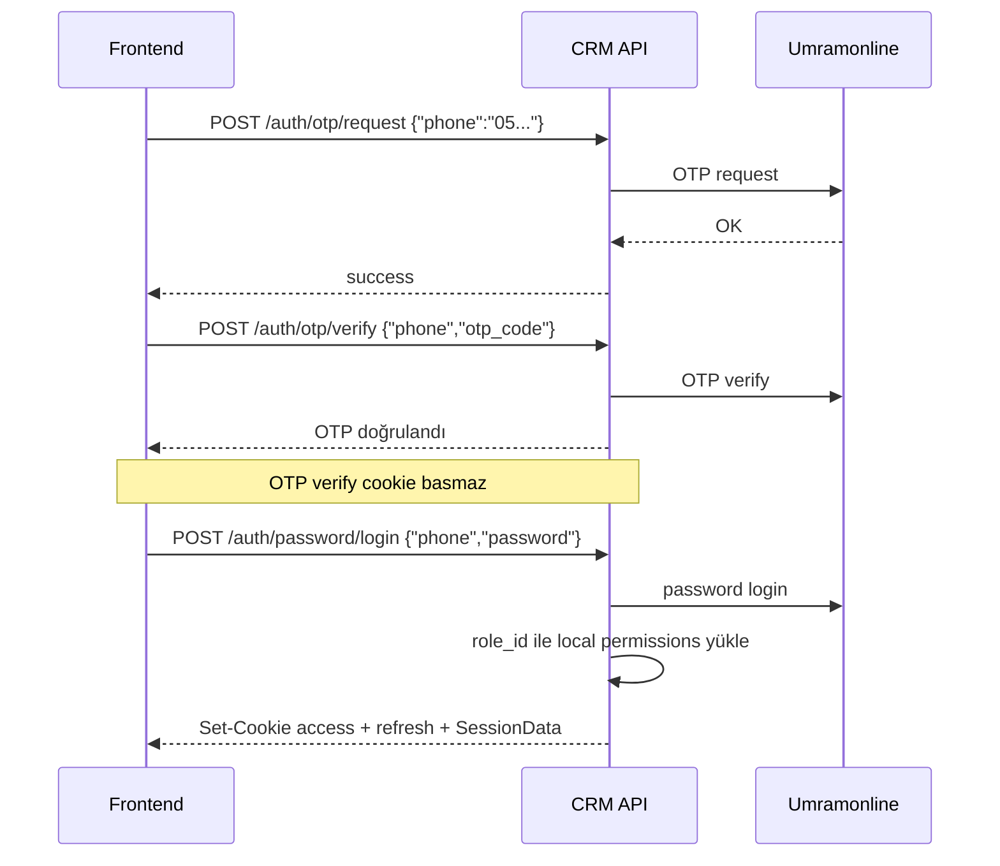

# Auth ve RBAC

## Kimlik doğrulama özeti

Kimlik Umramonline’da doğrulanır; bu backend kendi HMAC-JWT cookie’lerini basar. Local kullanıcı tablosu yoktur.

## Auth endpoint’leri

| Method | Path | Auth | Açıklama |
|--------|------|------|----------|
| POST | `/api/v1/auth/otp/request` | Public | OTP gönder |
| POST | `/api/v1/auth/otp/verify` | Public | OTP doğrula |
| POST | `/api/v1/auth/password/login` | Public | Login + cookie bas |
| POST | `/api/v1/auth/refresh` | Refresh cookie | Access yenile |
| POST | `/api/v1/auth/logout` | Public | Cookie temizle |
| GET | `/api/v1/auth/session` | Access cookie | Session + permissions |

## Login akışı



### Kritik davranış

**OTP verify oturum açmaz.** Session yalnızca password login ile oluşur (mevcut implementasyon).

### Request body örnekleri

OTP request:

```json
{ "phone": "05XXXXXXXXX" }
```

OTP verify:

```json
{ "phone": "05XXXXXXXXX", "otp_code": "123456" }
```

Password login:

```json
{ "phone": "05XXXXXXXXX", "password": "..." }
```

### Validasyon kuralları

- Telefon: `05` + 9 rakam (`ValidatePhone`)
- OTP: tam 6 rakam (`ValidateOTPCode`)
- Password: boş olmamalı

## Cookie’ler

| Cookie | Default ad | Path | TTL | Flags |
|--------|------------|------|-----|-------|
| Access | `access_token` | `/` | `ACCESS_TOKEN_TTL_MINUTES` (15m) | HttpOnly, Secure/SameSite config’ten |
| Refresh | `refresh_token` | `/api/v1/auth/refresh` | `REFRESH_TOKEN_TTL_DAYS` (30d) | Aynı |

Logout her iki cookie’yi `MaxAge = -1` ile siler.

## Token formatı

3rd-party JWT lib kullanılmaz. El yapımı:

```
base64url(header).base64url(claims).base64url(HMAC-SHA256)
```

Header:

```json
{ "alg": "HS256", "typ": "JWT" }
```

Claims (`SessionTokenClaims`):

| Alan | Açıklama |
|------|----------|
| `user_id` | Kullanıcı ID |
| `role_id` | Rol ID |
| `role_name` | Rol adı |
| `user_full_name` | Ad soyad |
| `typ` | `access` veya `refresh` |
| `exp` | Unix expiry |
| `branch_ids` | Şube ID listesi (admin’de yok) |
| `branches` | Şube detayları (admin’de yok) |

Admin rolü: `role_id == 30` (`internal/shared/auth/roles.go`). Admin token’ında branch claim’leri çıkarılır.

Token’lar stateless’tır; sunucu tarafında store / blacklist yoktur.

## Session response

Login / refresh / session cevaplarında `data` tipik olarak:

```json
{
  "user_id": 1,
  "user": {
    "id": 1,
    "full_name": "...",
    "phone": "05...",
    "role_id": 30,
    "role_name": "Admin",
    "branch_ids": [],
    "branches": []
  },
  "permissions": [
    {
      "module_id": 1,
      "module_name": "customers",
      "module_method_id": 10,
      "name": "customers.list",
      "description": "...",
      "method": "GET",
      "path": "/api/v1/customers"
    }
  ]
}
```

## RBAC modeli

### Tablolar

| Tablo | Amaç |
|-------|------|
| `modules` | Özellik alanı (`customers`, `tasks`, …) |
| `module_methods` | İzin birimi; opsiyonel HTTP `method` + `path` |
| `role_permissions` | `(role_id, module_method_id)` eşlemesi |

Roller local DB’de tutulmaz; Umramonline `ListRoles` ile gelir.

### Middleware: `RequirePermission`

1. `access_token` cookie oku
2. Token’ı `typ=access` olarak doğrula
3. `role_id == 0` ise 403
4. `RoleHasAccess(roleID, HTTP method, Fiber route path)` çağır
5. Eşleşme yoksa 403; varsa `c.Locals("claims", claims)`

Path eşlemesi Fiber **route template** ile yapılır (ör. `/api/v1/customers/:id`), concrete URL ile değil.

### UI-only vs route permission

Bazı method’ların HTTP method/path’i yoktur (`*.menu`, `*.form`). Bunlar frontend menü/form görünürlüğü içindir; `RoleHasAccess` bunları kullanmaz.

## Seed’lenen permission’lar

Startup’ta seed’ler upsert edilir ve admin (`role_id = 30`) izinleri yazılır.

### `authorization` modülü

Admin’e verilenler (kısmi): `authorization.menu`, `role_permissions.form`, `roles.list`, `module_methods.list`, `role_permissions.list`, `role_permissions.update`.

Tüm method seed’leri: menu/form’lar + roles/modules/module-methods/role-permissions CRUD path’leri.

### `customers` modülü

Admin’e tüm method’lar:

| Name | Method | Path |
|------|--------|------|
| `customers.menu` | — | — |
| `customers.list` | GET | `/api/v1/customers` |
| `customers.list.umramonline` | GET | `/api/v1/customers/umramonline` |
| `customers.list.umramonline.my_branches` | GET | `/api/v1/customers/umramonline/my-branches` |
| `customers.list.backend` | GET | `/api/v1/customers/backend` |
| `customers.list.backend.my_branches` | GET | `/api/v1/customers/backend/my-branches` |
| `customers.search` | GET | `/api/v1/customers/search` |
| `customers.detail` | GET | `/api/v1/customers/:id` |
| `customers.detail.umramonline` | GET | `/api/v1/customers/umramonline/:id` |
| `customers.detail.backend` | GET | `/api/v1/customers/backend/:id` |
| `customers.create` | POST | `/api/v1/customers` |
| `customers.full_registration.detail` | GET | `/api/v1/customers/full-registration/:id` |
| `customers.full_registration.phone_exists` | GET | `/api/v1/customers/full-registration/:id/phone-exists` |
| `customers.full_registration.update` | PUT | `/api/v1/customers/full-registration/:id` |
| `customers.zones.list` | GET | `/api/v1/zones` |
| `customers.cities.list` | GET | `/api/v1/cities` |
| `customers.towns.list` | GET | `/api/v1/towns` |
| `customers.branches.list` | GET | `/api/v1/branches` |
| `customers.branches.users.list` | GET | `/api/v1/branches/:id/users` |

### `tasks` modülü

| Name | Method | Path |
|------|--------|------|
| `tasks.menu` | — | — |
| `tasks.list` | GET | `/api/v1/tasks` |
| `tasks.assigned.list` | GET | `/api/v1/tasks/assigned-to-me` |
| `tasks.detail` | GET | `/api/v1/tasks/:uuid` |
| `tasks.cancel` | PATCH | `/api/v1/tasks/:uuid/cancel` |
| `tasks.create` | POST | `/api/v1/tasks` |

### `follow_ups` modülü

| Name | Method | Path |
|------|--------|------|
| `follow_ups.menu` | — | — |
| `follow_ups.list` | GET | `/api/v1/follow-ups` |
| `follow_ups.assigned.list` | GET | `/api/v1/follow-ups/assigned-to-me` |
| `follow_ups.detail` | GET | `/api/v1/follow-ups/:uuid` |
| `follow_ups.create` | POST | `/api/v1/follow-ups` |
| `follow_ups.create.standalone` | POST | `/api/v1/follow-ups/standalone` |
| `follow_ups.update` | PUT | `/api/v1/follow-ups/:uuid` |

### `ietts` modülü

| Name | Method | Path |
|------|--------|------|
| `ietts.menu` | — | — |
| `ietts.list` | GET | `/api/v1/ietts` |
| `ietts.convert_to_customer` | POST | `/api/v1/ietts/:uuid/convert-to-customer` |

### `dashboard` modülü

| Name | Method | Path |
|------|--------|------|
| `dashboard.menu` | — | — |
| `dashboard.view` | GET | `/api/v1/dashboard` |

## Authorization yönetim API’si

Tümü session + permission gerektirir:

| Method | Path | Açıklama |
|--------|------|----------|
| GET | `/authorization/roles` | Umramonline roller |
| GET/POST | `/authorization/modules` | Modül list / create |
| PUT/DELETE | `/authorization/modules/:id` | Update / delete |
| GET/POST | `/authorization/module-methods` | Method list / create (`module_id` query) |
| PUT/DELETE | `/authorization/module-methods/:id` | Update / delete |
| GET | `/authorization/role-permissions` | Role izinleri (`role_id` query) |
| PUT | `/authorization/role-permissions/:role_id` | Role izinlerini topluca değiştir |

> Route path değişirse seed’deki `path` değerleri ve mevcut DB kayıtları güncellenmelidir; aksi halde `RoleHasAccess` 403 üretir.
