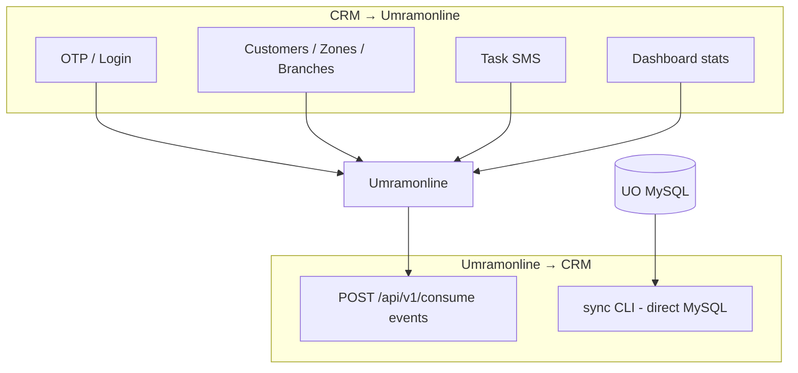

# Umramonline Entegrasyonu

## Genel

CRM backend, Umramonline’ı hem kimlik kaynağı hem de referans/operasyonel veri kaynağı olarak kullanır.

**Client:** `internal/umramonline/client.go`

### Ortak header’lar

Her istekte:

- `X-API-KEY: {UMRAMONLINE_API_KEY}`
- `Authorization: Bearer {UMRAMONLINE_API_TOKEN}`
- `Accept` / `Content-Type: application/json`

`BaseURL`, API key ve token boş olmamalıdır.

## Client metodları

| Client method | HTTP | Default path |
|---------------|------|--------------|
| `RequestOTP` | POST | `/api/v1/crm/auth/otp/request` |
| `VerifyOTP` | POST | `/api/v1/crm/auth/otp/verify` |
| `LoginWithPassword` | POST | `/api/v1/crm/auth/password/login` |
| `ListRoles` | GET | `/api/v1/crm/auth/user-roles` |
| `ListCustomers` | POST | `/api/v1/crm/customers` |
| `GetCustomer` | GET | `/api/v1/crm/customers/{id}` |
| `SearchCustomer` | GET | `/api/v1/crm/customers/search?q=` |
| `CustomerPhoneExists` | GET | `/api/v1/crm/customers/phone-exists?phone=` |
| `ListZones` | GET | `/api/v1/crm/zones` (+ `branch_ids[]`) |
| `ListCities` | GET | `/api/v1/crm/cities` |
| `ListTowns` | GET | `/api/v1/crm/towns?city_id=` |
| `ListBranches` | GET | `/api/v1/crm/branches` |
| `GetBranch` | GET | `/api/v1/crm/branches/{id}` |
| `ListBranchUsers` | GET | `/api/v1/crm/branches/{id}/users` |
| `GetBranchUser` | GET | `/api/v1/crm/branches/{id}/users/{userId}` |
| `SendTaskCreatedSMS` | POST | `/api/v1/crm/tasks/sms-created` |
| `DashboardVehicleEntryCount` | GET | `/api/v1/crm/dashboard/vehicle-entry-count` |
| `DashboardTotalAmount` | GET | `/api/v1/crm/dashboard/total-amount` |
| `DashboardLoadedCredit` | GET | `/api/v1/crm/dashboard/loaded-credit` |

Dashboard query parametreleri: `start_date`, `end_date`, opsiyonel `branch_ids[]` (`AllowAllBranches` ise branch gönderilmez).

## Modül kullanım matrisi

| CRM modülü | Adapter | Umramonline kullanımı |
|------------|---------|------------------------|
| auth | Doğrudan client | OTP request/verify, password login |
| authorization | `authorization/.../umramonline` | `ListRoles` |
| customer | `customer/.../umramonline` | customers, search, phone-exists, zones, cities, towns, branches, users |
| task | `task/.../umramonline` | GetBranch, GetBranchUser, SendTaskCreatedSMS |
| dashboard | `dashboard/.../umramonline` | vehicle entry, total amount, loaded credit |
| followup | — | HTTP çağrısı yok |
| ietts | — | HTTP çağrısı yok |
| consume | — | HTTP çağrısı yok (UO CRM’e event gönderir) |

## Veri akış yönleri

## Anti-Corruption Layer

Her modül kendi `Provider` tipi ile Umramonline cevabını domain DTO’larına map’ler. Application katmanı ham UO JSON’u görmez; interface üzerinden çalışır. Bu sayede UO şema değişiklikleri adapter’da izole edilebilir.

## Hata yaklaşımları

- UO 422 (login): kimlik bilgileri hatalı
- Timeout: `UMRAMONLINE_TIMEOUT_SECONDS`
- Downstream unavailable: application katmanında `*Unavailable` hataları → HTTP 5xx / anlamlı mesaj

## Sync CLI ayrımı

`cmd/sync-umramonline-customers` Umramonline **HTTP API** kullanmaz; kaynak MySQL’e doğrudan bağlanır. Bu, API entegrasyonundan ayrı bir operasyonel araçtır.
